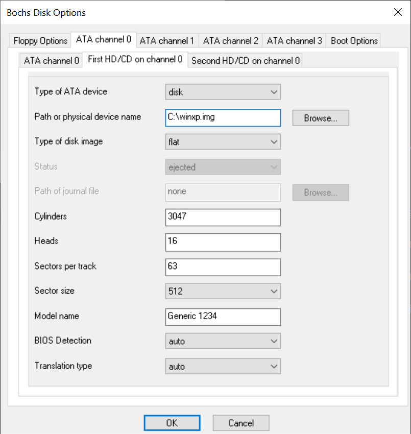
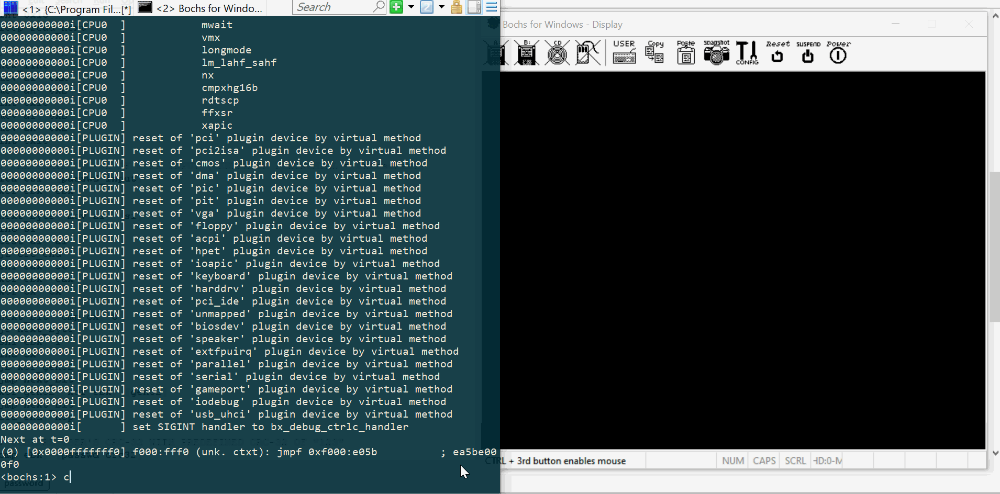

# Motivation

Learning assembly language and CRC hash algorithm

# Description

Password locks MBR and prevent Windows XP from further loading

# Installation

1. Download Windows XP image (_winxp.img_ further)
2. Copy original _winxp.img_ MBR (0:512 bytes) to 0x3600
3. Compile _prologue_mbr.asm_ and insert bytes instead of
 original MBR _winxp.img_
4. Compile _password.asm_ and insert bytes with 0x3400 offset
_winxp.img_
5. Run _bochs 2.6.11_ with following config

    
 
 # Demo
 
